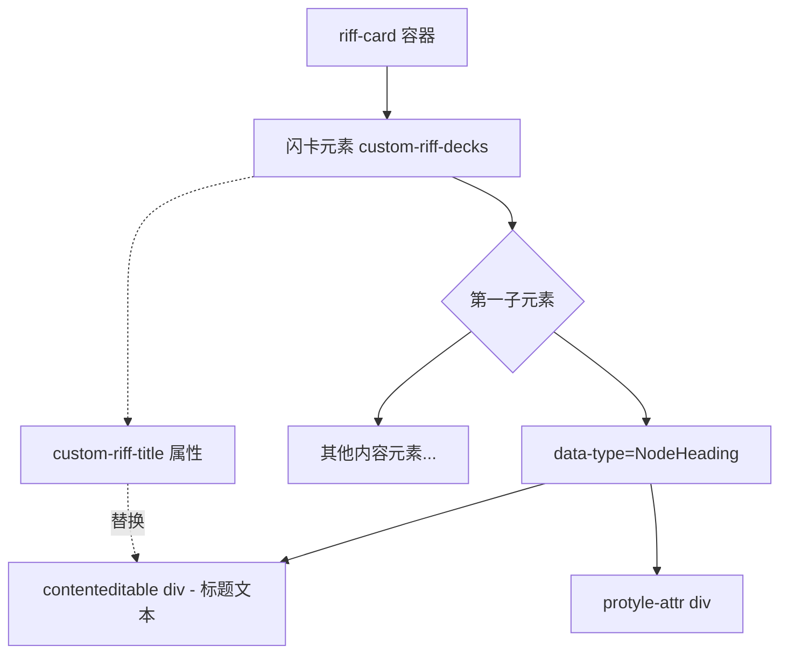
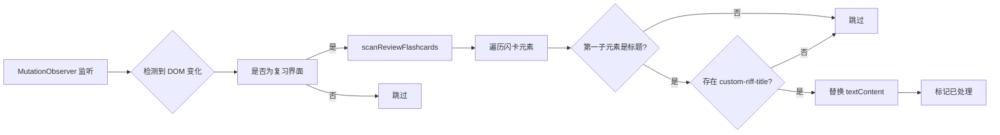

# 闪卡标题替换功能实现计划

## 需求概述

在闪卡复习界面中，当闪卡加载完成时，检测第一行是否为标题元素，若存在 `custom-riff-title` 属性且非空，则替换标题的显示文本内容。

## 核心需求

| 项目 | 说明 |
|------|------|
| 触发场景 | 仅在闪卡复习界面（`riff-card` 容器）生效 |
| 闪卡标识 | 具有 `custom-riff-decks` 属性的元素 |
| 标题判定 | `data-type="NodeHeading"` 的元素 |
| 标题来源 | 闪卡 DOM 的 `custom-riff-title` 属性 |
| 替换方式 | 仅修改 `textContent`，保持 DOM 结构不变 |

## DOM 结构分析



### 关键 DOM 特征

从案例 HTML 分析：

1. **闪卡容器**：`[custom-riff-decks]` 属性
2. **标题元素**：
   - `data-type="NodeHeading"`
   - `class="h1"` / `"h2"` / `"h3"` 等
   - 标题文本位于子元素 `div[contenteditable="true"]` 中
3. **自定义标题**：`custom-riff-title` 属性存储在闪卡元素上

## 实现方案

### 1. 常量定义 (constants.ts)

```typescript
// 复习界面标题替换相关
export const REVIEW_FLASHCARD_SELECTOR = '.riff-card [custom-riff-decks]';
export const HEADING_TYPE = 'NodeHeading';
export const HEADING_TEXT_SELECTOR = 'div[contenteditable="true"]';
export const TITLE_REPLACED_FLAG = 'data-title-replaced';
```

### 2. 工具函数 (utils.ts)

```typescript
/**
 * 检测元素是否为标题元素
 * @param element 待检测元素
 * @returns 是否为标题元素
 */
export const isHeadingElement = (element: HTMLElement): boolean => {
  return element.getAttribute('data-type') === 'NodeHeading';
};

/**
 * 获取标题文本元素
 * @param headingElement 标题元素
 * @returns 标题文本 div 元素
 */
export const getHeadingTextElement = (headingElement: HTMLElement): HTMLElement | null => {
  return headingElement.querySelector<HTMLElement>('div[contenteditable="true"]');
};

/**
 * 获取闪卡的自定义标题
 * @param cardElement 闪卡元素
 * @returns 自定义标题或 null
 */
export const getCustomTitle = (cardElement: HTMLElement): string | null => {
  const title = cardElement.getAttribute('custom-riff-title');
  return title && title.trim() ? title.trim() : null;
};
```

### 3. 核心逻辑 (index.ts)

```typescript
/**
 * 替换单个闪卡的标题
 * @param cardElement 闪卡元素
 */
const replaceFlashcardTitle = (cardElement: HTMLElement) => {
  // 检查是否已替换，避免重复处理
  if (cardElement.hasAttribute(TITLE_REPLACED_FLAG)) return;
  
  // 获取自定义标题
  const customTitle = getCustomTitle(cardElement);
  if (!customTitle) return;
  
  // 获取第一个子元素
  const firstChild = cardElement.querySelector<HTMLElement>(':scope > div');
  if (!firstChild || !isHeadingElement(firstChild)) return;
  
  // 获取标题文本元素
  const textElement = getHeadingTextElement(firstChild);
  if (!textElement) return;
  
  // 仅替换文本内容，保持所有属性和结构不变
  textElement.textContent = customTitle;
  
  // 标记已处理
  cardElement.setAttribute(TITLE_REPLACED_FLAG, 'true');
};

/**
 * 扫描复习界面所有闪卡并替换标题
 */
const scanReviewFlashcards = () => {
  const cards = document.querySelectorAll<HTMLElement>(REVIEW_FLASHCARD_SELECTOR);
  cards.forEach(replaceFlashcardTitle);
};
```

### 4. MutationObserver 集成



## 文件修改清单

| 文件 | 修改内容 |
|------|----------|
| [`constants.ts`](src/features/flashcard-title-editor/constants.ts) | 添加复习界面选择器和标记常量 |
| [`utils.ts`](src/features/flashcard-title-editor/utils.ts) | 添加标题检测和获取函数 |
| [`index.ts`](src/features/flashcard-title-editor/index.ts) | 添加复习界面标题替换逻辑和监听 |

## 实现步骤

1. **添加常量** - 在 `constants.ts` 中定义复习界面相关选择器
2. **添加工具函数** - 在 `utils.ts` 中实现标题检测和获取逻辑
3. **实现核心替换逻辑** - 在 `index.ts` 中实现 `replaceFlashcardTitle` 函数
4. **添加复习界面监听** - 创建独立的 MutationObserver 监听复习界面
5. **集成到初始化流程** - 在 `init` 函数中启动复习界面监听
6. **清理资源** - 在 `cleanup` 函数中断开复习界面监听

## 注意事项

1. **避免重复替换**：使用 `data-title-replaced` 标记避免对同一闪卡重复处理
2. **性能优化**：仅在检测到复习界面相关 DOM 变化时执行扫描
3. **最小化修改**：仅修改 `textContent`，不触碰任何属性、样式或事件绑定
4. **向后兼容**：保持现有编辑器视图功能不变
